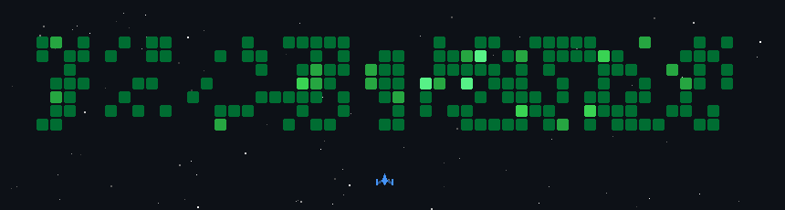

  

  

    <strong>What's up bro!</strong> 
    Xin Chào! - 안녕하새요!
  

  
  
  

   

  

---

### `<About_me />`

- Third-year Software Engineering student at Ton Duc Thang University (CGPA: 8.21/10), based in Ho Chi Minh City, Vietnam.
- Backend-focused Full Stack Developer interested in backend systems, DevOps, and reliable software engineering.
- Key Member – Software Engineer / DevOps at AIAI Laboratory since November 2025, working on research software, integrations, deployment, and monitoring.
- Built an online judge used by 200+ students across 800+ sessions, an AI-powered research management system, and a real-time event check-in platform.
- I like building web apps, game ideas, and small products that feel useful.

### `<Current_focus />`

- Building backend systems with TypeScript, Node.js, NestJS, FastAPI, REST APIs, and microservices.
- Working on AI features with RAG, LangChain, OpenAI/Gemini APIs, and asynchronous document processing.
- Using PostgreSQL, MongoDB, Redis, and Qdrant for application data and AI workflows.
- Managing deployments and monitoring with Docker, Nginx, Grafana, Linux, Cloudflare, AWS EC2, and Oracle Cloud.
- Building web, desktop, and mobile apps with React, Next.js, React Native, Flutter, and Tauri.

### `<Tech_stack />`

  

### `<GitHub_activity />`

  

  <strong>Thanks for visiting. Have a good day!</strong>

